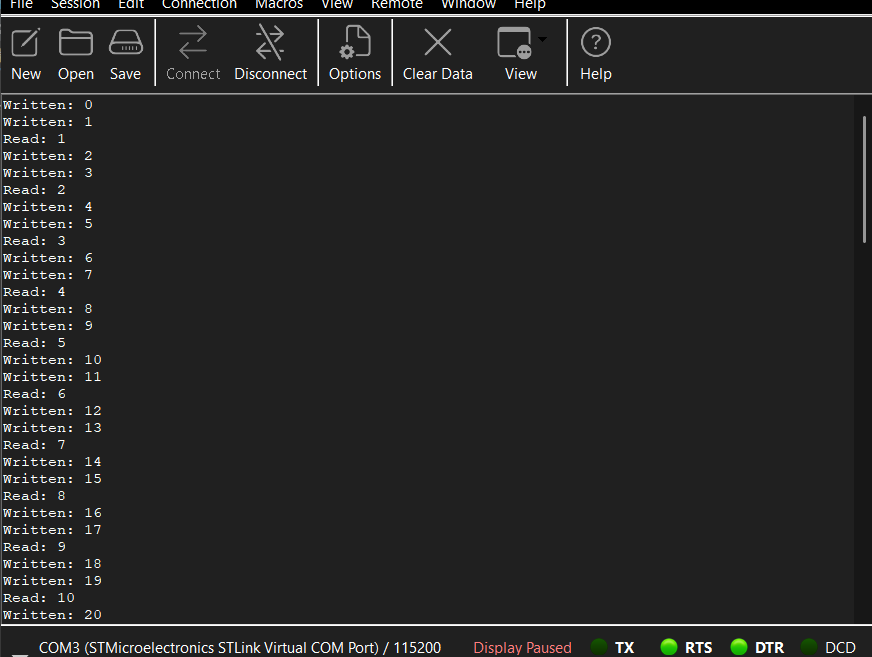
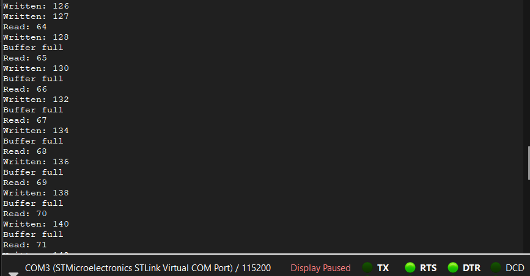

# FreeRTOS Thread-Safe Ring Buffer — STM32F446RE

A firmware project demonstrating a thread-safe circular buffer built from scratch in C, running on the STM32F446RE Nucleo board with FreeRTOS.

## What it demonstrates
- Ring buffer implementation from scratch in C (head, tail, count logic)
- FreeRTOS mutex for thread safety between concurrent tasks
- Producer/consumer task pattern using xTaskCreate
- printf retargeting to UART over ST-Link virtual COM port

## Hardware
- **Board:** STM32F446RE Nucleo
- **IDE:** STM32CubeIDE
- **RTOS:** FreeRTOS (via CMSIS-RTOS v2)
- **UART:** USART2 at 115200 baud (ST-Link virtual COM port)

## How it works
A producer task writes an incrementing counter byte into the ring buffer every 500ms. A consumer task reads from the buffer every 1000ms. Access to the buffer is protected by a FreeRTOS mutex, preventing race conditions on the shared head, tail, and count variables.

## Serial output

## Project structure
- `Core/Inc/ring_buffer.h` — ring buffer struct and function declarations
- `Core/Src/ring_buffer.c` — ring buffer implementation
- `Core/Src/main.c` — FreeRTOS tasks and scheduler setup
